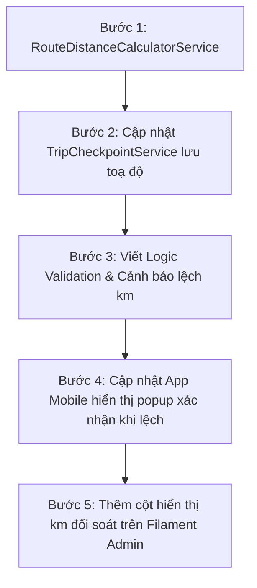

# Kế Hoạch Triển Khai: Đối Soát & Chặn Lỗi Nhập Km Theo Checkpoint (Không Dùng Background Service)

> **Mục tiêu:** Xây dựng cơ chế xác thực số Km tài xế nhập tại các mốc trạng thái (Checkpoint) nhằm ngăn chặn việc **nhập nhầm số công tơ mét** (gõ thừa/thiếu số) hoặc **gian lận khai khống km**.  
> **Định hướng kiến trúc:** 100% trong **Laravel**, tinh gọn, không cần chạy background service ngoài (`services-gps`), không sinh thêm bảng dữ liệu toạ độ khổng lồ.

---

## I. Tổng Quan Giải Pháp (Architectural Blueprint)

### 1. Nguyên lý vận hành On-Demand

Thay vì liên tục quét toạ độ của mọi xe 20 giây một lần (gây nặng tải và rác database), hệ thống chỉ kích hoạt đo đạc tại **khoảnh khắc tài xế tương tác với ứng dụng (Checkpoint)**:

```
[Checkpoint A: Điểm nhận] ──────────────── (Chặng đường chạy thực tế) ──────────────── [Checkpoint B: Điểm giao]
      │                                                                                            │
  Tài xế bấm                                                                                   Tài xế bấm
  Nhập Km taplo: 100.000                                                                       Nhập Km taplo: 100.045
  Lưu GPS A: (latA, lngA)                                                                      Lưu GPS B: (latB, lngB)
                                                                                                   │
                                                                                       ┌───────────▼───────────┐
                                                                                       │   VALIDATION ENGINE   │
                                                                                       │                       │
                                                                                       │ Km tài xế: 45 km      │
                                                                                       │ Km OSRM: 42.8 km    │
                                                                                       │ Chênh lệch: +2.2 km   │
                                                                                       │ (Dung sai +5.1% -> OK)│
                                                                                       └───────────────────────┘
```

### 2. Ưu thế so với giải pháp chạy Poller liên tục

| Tiêu chí                 | Giải pháp Chạy Poller Liên Tục (`services-gps`)          | Giải pháp On-Checkpoint (Đề xuất này)                                                    |
| :----------------------- | :------------------------------------------------------- | :--------------------------------------------------------------------------------------- |
| **Hạ tầng**              | Cần chạy Bun/Node daemon 24/7, tốn RAM, dễ rủi ro crash. | **Chạy 100% trong Laravel**, không cần tiến trình nền.                                   |
| **Dung lượng DB**        | Hàng trăm nghìn bản ghi toạ độ mỗi ngày.                 | **0 byte bảng mới**, dùng luôn cột `gps_lat`, `gps_lng` sẵn có trong `trip_checkpoints`. |
| **Bảo trì**              | Phải quản lý đồng bộ 2 database / 2 service.             | **1 codebase duy nhất**, debug và test bằng Pest test dễ dàng.                           |
| **Thời gian triển khai** | 3 - 5 ngày.                                              | **1 - 2 ngày**.                                                                          |

---

## II. Cơ Chế Thu Thập Toạ Độ Khi Bấm Checkpoint

Khi tài xế bấm cập nhật một trạng thái (ví dụ: _Đến điểm nhận_, _Đến điểm giao_, _Hoàn thành_):

1. **Nguồn 1 — GPS từ Điện thoại (Mobile App gửi lên):**
    - App React Native / Expo lấy vị trí GPS tức thời qua native API (`expo-location`) đính kèm vào payload gửi lên API:
        ```json
        {
            "checkpoint_type": "arrived_delivery",
            "km_reading": 100045,
            "device_lat": 21.21045,
            "device_lng": 105.81234
        }
        ```
2. **Nguồn 2 — GPS từ Hộp đen xe (EUP API):**
    - Laravel gọi hàm `EupGpsService->getVehicleLocation($plateNumber)` để lấy toạ độ mới nhất mà thiết bị hộp đen gửi về.
3. **Lưu trữ:**
    - Ghi nhận toạ độ vào bản ghi `trip_checkpoints` của trạng thái tương ứng (`gps_lat`, `gps_lng`).
    - _(Tùy chọn nâng cao)_: So sánh toạ độ điện thoại tài xế và toạ độ xe từ EUP. Nếu lệch nhau quá 500m $\rightarrow$ Cảnh báo tài xế không ở cạnh xe.

---

## III. Thuật Toán Tính Km & Quy Tắc Xác Thực (Validation Engine)

### 1. Tại sao bắt buộc dùng Routing Distance (OSRM / Bản đồ đường bộ)?

- **Tuyệt đối KHÔNG dùng đường chim bay (Haversine):** Đường chim bay luôn ngắn hơn đường bộ từ **20% đến 40%**. Dùng đường chim bay sẽ báo lỗi nhầm 100% số chuyến của tài xế.
- **Sử dụng API chỉ đường đường bộ:** Giữa 2 điểm Checkpoint $A (lat_A, lng_A)$ và $B (lat_B, lng_B)$, gọi Routing API (dự án đã tích hợp sẵn `OsrmService` hoàn toàn miễn phí) để lấy độ dài quãng đường đường bộ tiêu chuẩn:
  $$D_{\text{routing}} = \text{OsrmRouteDistance}(A, B)$$

### 2. Công thức tính và dải dung sai (Tolerance Matrix)

- **Số km tài xế khai báo cho chặng:**
  $$\Delta_{\text{driver}} = \text{Km\_Reading}_B - \text{Km\_Reading}_A$$
- **Độ lệch tuyệt đối và phần trăm lệch:**
  $$\text{Diff}_{\text{km}} = \Delta_{\text{driver}} - D_{\text{routing}}$$
  $$\text{Diff}_{\%} = \left( \frac{\Delta_{\text{driver}} - D_{\text{routing}}}{D_{\text{routing}}} \right) \times 100\%$$

- **Ma trận phân loại trạng thái:**

| Mức độ                                  | Điều kiện                                                                  | Phản hồi của Hệ thống                                                                                                                                                                              |
| :-------------------------------------- | :------------------------------------------------------------------------- | :------------------------------------------------------------------------------------------------------------------------------------------------------------------------------------------------- | ---------------- | ---------------------------------- |
| 🟢 **HỢP LỆ (PASS)**                    | Lệch trong khoảng **$-10\% \le \text{Diff}_{\%} \le +15\%$** (hoặc $       | \text{Diff}\_{\text{km}}                                                                                                                                                                           | \le 3\text{km}$) | Chấp thuận checkpoint bình thường. |
| 🟡 **CẢNH BÁO NHẬP NHẦM (WARNING)**     | Lệch từ **$+15\% \rightarrow +35\%$** hoặc gõ số km nhỏ hơn                | Trả về mã cảnh báo cho App. App bật Popup: _"Số km bạn nhập (45 km) lệch so với khoảng cách đường bộ ước tính (35 km). Bạn có chắc chắn không?"_ Cho tài xế kiểm tra lại taplo để sửa nếu gõ nhầm. |
| 🔴 **BẤT THƯỜNG / GIAN LẬN (CRITICAL)** | Lệch **$> +35\%$** (hoặc $> 15\text{km}$), hoặc gõ sai hàng chục/hàng trăm | Bắt buộc tài xế chụp ảnh taplo xe. Tự động gắn cờ `TripKmReport` trạng thái `Pending` để Điều hành đối soát trên Filament.                                                                         |

---

## IV. Kiểm Tra Điểm Đến (Chống Check-in Ảo / Geofencing)

Bên cạnh việc đối soát km, việc lưu toạ độ Checkpoint còn giải quyết triệt để vấn đề tài xế ngồi một chỗ bấm nhận/giao hàng khống:

- Khi tài xế bấm `arrived_pickup` hoặc `arrived_delivery`:
    - Lấy toạ độ điểm giao nhận của khách hàng trong bảng `customer_location` / `locations`.
    - Tính khoảng cách từ vị trí GPS xe đến điểm giao nhận:
      $$R = \text{Distance}(GPS_{\text{xe}}, GPS_{\text{kho\_khách}})$$
    - Nếu $R > 1.000\text{m}$ (ngoài bán kính 1km): Cảnh báo _"Xe chưa đến gần điểm giao hàng (cách 2.5 km). Vui lòng kiểm tra lại vị trí."_

---

## V. Thiết Kế Code Triển Khai Trong Laravel

### 1. Sử dụng `App\Services\OsrmService` (ĐÃ CÓ SẴN TRONG DỰ ÁN — MIỄN PHÍ 100%)

Dự án TMS hiện tại đã có sẵn file [`app/Services/OsrmService.php`](file:///Users/cuongpham/Deverlop/ASGL/tms-asgt/app/Services/OsrmService.php) dùng để vẽ lộ trình bám đường trên bản đồ Filament và Mobile App. Ta tận dụng luôn service này để lấy khoảng cách đường bộ mà **không tốn 1 đồng chi phí API**:

```php
namespace App\Services;

class RouteDistanceCalculatorService
{
    public function __construct(
        private readonly OsrmService $osrmService,
    ) {}

    /**
     * Lấy khoảng cách đường bộ (km) giữa 2 điểm Checkpoint.
     * Ưu tiên 1: OSRM Routing (độ chính xác cao, bám đường thực tế).
     * Ưu tiên 2: Fallback công thức uốn lượn đường bộ (Offline 100% khi mất mạng).
     */
    public function calculateDistanceKm(float $lat1, float $lng1, float $lat2, float $lng2): float
    {
        // 1. Gọi OSRM có sẵn trong dự án (đã có sẵn Cache 30 phút)
        $route = $this->osrmService->getRoute($lat1, $lng1, $lat2, $lng2);

        if (!empty($route['success']) && isset($route['data']['distance'])) {
            // distance từ OSRM tính theo mét -> chia 1000 ra km
            return round($route['data']['distance'] / 1000, 1);
        }

        // 2. Fallback: Nếu OSRM lỗi mạng hoặc timeout -> dùng công thức uốn lượn đường bộ
        return $this->fallbackRoadDistanceKm($lat1, $lng1, $lat2, $lng2);
    }

    /**
     * Tính cự ly đường bộ ước lượng thuần toán học (Không cần API, không cần mạng).
     * Bằng cự ly chim bay (Haversine) nhân với Hệ số uốn lượn đường bộ VN (1.30).
     */
    private function fallbackRoadDistanceKm(float $lat1, float $lng1, float $lat2, float $lng2): float
    {
        $earthRadiusKm = 6371;
        $dLat = deg2rad($lat2 - $lat1);
        $dLng = deg2rad($lng2 - $lng1);

        $a = sin($dLat / 2) * sin($dLat / 2) +
             cos(deg2rad($lat1)) * cos(deg2rad($lat2)) *
             sin($dLng / 2) * sin($dLng / 2);

        $c = 2 * atan2(sqrt($a), sqrt(1 - $a));
        $crowFlyKm = $earthRadiusKm * $c;

        // Hệ số uốn lượn đường bộ đồng bằng & quốc lộ Việt Nam (Detour Factor ~ 1.30)
        return round($crowFlyKm * 1.30, 1);
    }
}
```

### 2. Tích hợp vào luồng ghi Checkpoint (`TripCheckpointService`)

Tại file `app/Services/Trip/TripCheckpointService.php`:

- Khi gọi `recordCheckpoint`:
    1. Lấy toạ độ xe hiện tại (ưu tiên toạ độ điện thoại gửi lên hoặc EUP).
    2. Lưu toạ độ vào bản ghi `trip_checkpoints` (`gps_lat`, `gps_lng`).
    3. Lấy checkpoint liền kề trước đó của cùng chuyến để lấy cặp toạ độ $(A, B)$ và số km trước đó.
    4. Gọi `RouteDistanceCalculatorService` (kết hợp `OsrmService` + Fallback toán học) tính khoảng cách đường bộ chuẩn $D_{\text{routing}}$.
    5. So sánh với $\Delta_{\text{km}}$ tài xế nhập $\rightarrow$ Đưa ra kết quả đối soát.

---

## VI. Kế Hoạch Các Bước Thực Hiện (Implementation Steps)



1. **Giai đoạn 1: Chuẩn bị Service tính cự ly**
    - Tạo `RouteDistanceCalculatorService` bọc quanh `OsrmService` đã có sẵn trong dự án (có fallback tính uốn lượn khi offline).
    - Viết Pest unit test kiểm tra độ chính xác với các cặp toạ độ mẫu (Hà Nội $\rightarrow$ Bắc Ninh).

2. **Giai đoạn 2: Tích hợp Checkpoint GPS**
    - Cập nhật API request nhận thêm `device_lat`, `device_lng` từ mobile app.
    - Ghi toạ độ vào bảng `trip_checkpoints`.
    - Tính toán khoảng cách chặng và đối soát với số `km_reading` mà tài xế gửi lên.

3. **Giai đoạn 3: Phản hồi & Xử lý ngoại lệ trên App Mobile**
    - Thêm modal cảnh báo trên App nếu số km chênh lệch $> 15\%$.
    - Nếu chênh lệch $> 35\%$, yêu cầu chụp ảnh taplo xe đính kèm vào `trip_km_reports`.

4. **Giai đoạn 4: Quản lý & Đối soát trên Filament**
    - Trên màn hình chi tiết chuyến đi ([TripResource](file:///Users/cuongpham/Deverlop/ASGL/tms-asgt/app/Filament/Resources/Trips/TripResource.php)) và [TripKmReportResource](file:///Users/cuongpham/Deverlop/ASGL/tms-asgt/app/Filament/Resources/TripKmReports/TripKmReportResource.php):
        - Hiển thị bảng so sánh: `Km tài xế báo` vs `Km quy chuẩn OSRM` vs `Tỉ lệ chênh lệch`.
        - Đánh dấu màu cảnh báo: Xanh lá (Hợp lệ) / Vàng (Lệch nhẹ) / Đỏ (Bất thường).

---

## VII. Xử Lý Thư Mục `services-gps`

Vì chuyển hoàn toàn sang giải pháp On-Checkpoint trong Laravel:

- Thư mục `services-gps` (Bun + Prisma) không còn được sử dụng trong luồng vận hành chính.
- **Hành động đề xuất:**
    - Có thể lưu trữ (archive) hoặc xóa thư mục `services-gps` để giữ codebase của dự án gọn gàng, tránh gây nhầm lẫn khi triển khai production.
